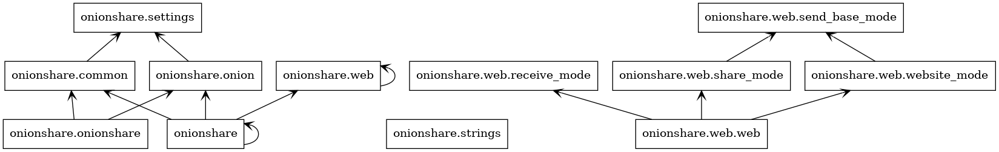
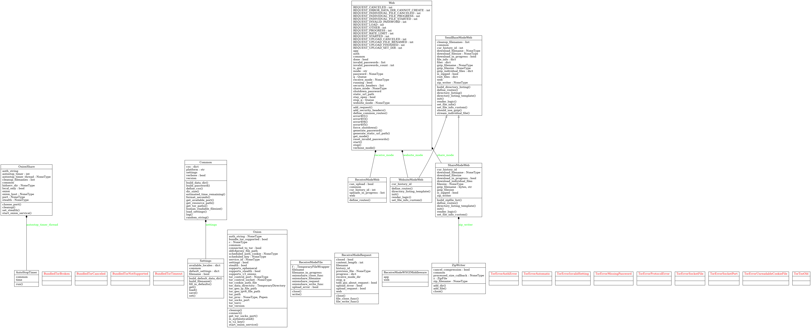

---
title:"Formal Audit of Onionshare"
output:pdf_document
---

# A (Kinda) Formal Security analysis of the OnionShare file sharing utility

*By Benjamin Krueger*

### Abstract
OnionShare is a utility written in python to allow users to share files easily and securely. It functions within the TOR network. In this paper, I will provide a background, anaylsis of code function, and security audit of this software. I will not be addressing the security of the TOR network or its protocol, although some explanation of TOR and hidden services will be required to gain an understanding of how OnionShare works.

## 1. Introduction
### Background
The TOR network implements what is known as "onion routing" which encrypts data in the application layer, then sends it through a series of relays known as a virtual circuit. Each relay has to decrypt a layer of the data to get the next node to send forward the data to. The final node, or exit node decrypts the original data and sends it to the recipient. This is done to hide the source address of the recipient address and hopefully mitigate network surveillance of the user of the network. TOR is most famous for the TOR browser bundle, which is a modified version of firefox ESR, in a convienient package that can be used like a normal browser to help hide internet browsing behavior. TOR can also be configured to setup what are known as "TOR hidden services". TOR hidden services are nothing more than (usually) web services that have been setup to recieve all inbound connections through tor. In order to setup access to such a service, one uses what are known as .onion addresses. .onion addresses are not true dns names, but instead 16 or 56 char alphanumeric strings which are generated from the public key of an onion service, followed by the suffix, ".onion".  Services using .onion domains may also add EV HTTPS certs to their sites in order to further prevent ssl stripping via malicios exit nodes. What OnionShare seeks to do is add dropbox or google drive like ease of use to the TOR network. It achieves this in a fairly simple manner. 
### Use
First, there are three different "modes" you can run OnionShare in:
1. Share files
    To share files, simply click the add path and add the file you wish to share to OnionShare, then click the "Start Sharing" button. This gives you a link to send to the file sharing recipient(s). When the recipient visits this link in the TOR browser, (or via the cmd line utility in Onionshare), they will be presented with an http download page to download the file(s) that the user chose to share.
2. Recieve files
    OnionShare has a "Receive mode". Similar to the share mode, but in the opposite direction. When started you get a link to an onion site. WHen this link is opened via the TOR browser, the user is then able to upload a file to the computer that generated that link. Of course, this has a few potential flaws as anyone with that link would be able to upload any file to your computer. 
3. Website mode. Similar to share mode but optimized for an entire website. Presumably, one would drop their website source files into a directory and share it in order to public a quick and easy TOR hidden service static webpage. After a file is downloaded from the webserver, the onion service and the webserver are shutdown. (although this can be bypassed in settings) 

### How it works 
When an OnionShare user shares a file, OnionShare starts a web server on localhost on a random port. THen it chooses two words from a 6800 word
called a slug, then serves the files on `localhost:[port]/slug/`. It then makes the web server a Tor onion server and gives the user the 
url :`http://[serviceaddress].onion/[slug]/`. This url can then be opened in the tor browser to upload/download files from the webserver, which is running on the users computer. 

## 2. Scope
https://github.com/micahflee/onionshare
## 3. Functionality and code diagrams
So, first I used pyreverse to generate some nice diagrams of the class/package structure of onionshare. This doesn't really reveal anything securirty wise but it lets me quickly navigate the software when looking for certain features and functionalities that I wish to check.
UML package diagram of codebase:

UML class diagram of codebase:

## 4. Security Model
So, in order to fairly evaluate this software we have to take into account the developers threat model.
From onionshare's github, we can gather these four things onionshare protects:
* Third parties don't have access to files being shared. 
    - Files are only hosted on sender/reciever computer.
* Network eavesdroppers can't spy on files in transit.
    - TOR is end to end encrypted, so eavsdropping networks can't decipher files.
    - If the eavsdropper is an ISP or malicious tor node, they only see TOR traffic.
    - If the eavesdropper is a malicious exit node, the traffic is encrypted using the onion service key.
* Anonymity of sender and recipient are protected by Tor.
    - As long as OnionShare link is shared anonymously.
* If an attacker enumerates the onion service, the shared files remain safe. 
    - IF someone manages to figure out the onion service by enumeration (generating the public key), they still must know the "slug", which has 46 million possible combinations. But, the hidden service will only allow 20 attempts before it disconnects the server.
    - Also checks URIs using a constant time string comparison function, so timing attacks can't be used. 

What it does not claim to protect:
* Communicating the OnionShare URL might not be secure.
* Communicating the OnionShare URL might not be anonymous.
* Assumes that the machine running OnionShare is not somehow compromised. 

## 5. Security Analysis
### Static Code analysis
*Is it doing what its __supposed__ to?*

So, in order to analyze these security claims, first we will take a look at the codebase to see the implementation of each of the threats that
the author claims to protect against. Now, because of the size of the project, I only looked at the code in the core of the project, not the UI. The UI does not directly interact
with the functions that I went over in the security model. 

#### Files are only hosted on sender/reciever computer.

As far as i can tell, there aren't any cloud services, uploads or other such things accessed, so this is likely true, as long as the multiple libraries don't have this issue.

#### TOR is end to end encrypted, so eavsdropping networks can't decipher files.

So here I need to prove that all of the files shared by OnionShare are routed over tor. First lets take a look at `__init__.py`. Here we find the initialization of an object:
`onion = Onion(common)` Common is the configuration object, and onion is the class that interfaces with the TOR proxy on the device and creating TOR hidden services. 
This class implements a function of interest:
`connect()`
`connect()` is called in the main function of __init__.py, and if it excepts it will crash the program. 
`connect()` Starts tor, and talks to the relay running on localhost to try to get a connection to the TOR network.
Seeing above was a good sign, `connect()` does a lot of platform specific stuff but knowing that execution will halt if `connect()` is not successful is good to see. 
Now lets look at the webserver side of this:
there is a `Web()` class that is largely a flask abstraction, it has a few subclasses that set up the http endpoints to serve or receive files with the flask webserver. The webserver sort of runs independently from the Onion and OnionShare processes, and starts last.

#### Anonymity of sender and recipient are protected by Tor.

This is largely dependent on how resillient the TOR network actually is to identification attacks. I imagine that end to end timing attacks are still possible on this, depending on the network and situation. It could definetly be possible to obtain higher levels of anonymity through bridges and other means. 

#### If an attacker enumerates the onion service, the shared files remain safe. 
In the web.py object, there is a function that generates a static url path based on a random 128 bit number. 
There is a "slug" in the code but it isn't called that. Instead it's just called a password. And around line 222 of the web.py class there is the 
code that 401 errors if there are more than 20 failed auths happen. 

### Bandit analysis

Reading the code is great and all, and gave me a good idea of how the program worked, but to find the really tough security bugs I decided to use a static analysis tool called bandit. Bandit found 17 low severity issues (that I won't go over), 1 medium and 1 high security bug. Here is a breakdown of some of the bugs bandit found:

#### Low Security Bug

>> Issue: [B311:blacklist] Standard pseudo-random generators are not suitable for security/cryptographic purposes.
   Severity: Low   Confidence: High
   Location: onionshare/common.py:484
   More Info: https://bandit.readthedocs.io/en/latest/blacklists/blacklist_calls.html#b311-random
483	                try:
484	                    tmpsock.bind(("127.0.0.1", random.randint(min_port, max_port)))
485	                    break

Here we see onionshare trying to bind to a random port but using a psuedorandom number generator. I don't think its an since the actual port you bind to is not going to make a difference in the security of 
the network connection.

#### Low Security Bug
>> Issue: [B404:blacklist] Consider possible security implications associated with subprocess module.
   Severity: Low   Confidence: High
   Location: onionshare/onion.py:25
   More Info: https://bandit.readthedocs.io/en/latest/blacklists/blacklist_imports.html#b404-import-subprocess
24	from Crypto.PublicKey import RSA
25	import base64, os, sys, tempfile, shutil, urllib, platform, subprocess, time, shlex
26	
27	from distutils.version import LooseVersion as Version

Bandit blacklists the subprocess module.

#### Low Security Bug
>> Issue: [B603:subprocess_without_shell_equals_true] subprocess call - check for execution of untrusted input.
   Severity: Low   Confidence: High
   Location: onionshare/onion.py:321
   More Info: https://bandit.readthedocs.io/en/latest/plugins/b603_subprocess_without_shell_equals_true.html
320	                startupinfo.dwFlags |= subprocess.STARTF_USESHOWWINDOW
321	                self.tor_proc = subprocess.Popen(
322	                    [self.tor_path, "-f", self.tor_torrc],
323	                    stdout=subprocess.PIPE,
324	                    stderr=subprocess.PIPE,
325	                    startupinfo=startupinfo,
326	                )

Calling an external executable can be an issue, but the threat model here assumes that there aren't any malicious actors running on the same host as OnionShare. 
There were 2 of these bugs. 

#### Low Security Bug

>> Issue: [B110:try_except_pass] Try, Except, Pass detected.
   Severity: Low   Confidence: High
   Location: onionshare/onion.py:413
   More Info: https://bandit.readthedocs.io/en/latest/plugins/b110_try_except_pass.html
412	                    found_tor = True
413	                except:
414	                    pass

Exception created from the tor controller not being able to bind to the default ports is passed. This happens serveral times in the onion.py code and in some other places, and in every instance,
the error is checked for later on so having the exception handled here would just further complicated things. 

#### Low Security Bug

>> Issue: [B105:hardcoded_password_string] Possible hardcoded password: ''
   Severity: Low   Confidence: Medium
   Location: onionshare/web/web.py:312
   More Info: https://bandit.readthedocs.io/en/latest/plugins/b105_hardcoded_password_string.html
311	        )
312	        if persistent_password != None and persistent_password != "":
313	            self.password = persistent_password

This actually looks like a security issue. However, the "persistent password" is only used when set in common.settings, which is None by default. Otherwise, a password is generated using a 
cryptographically secure random algorithm. 

#### Medium Severity Bug
>> Issue: [B104:hardcoded_bind_all_interfaces] Possible binding to all interfaces.
   Severity: Medium   Confidence: Medium
   Location: onionshare/web/web.py:373
   More Info: https://bandit.readthedocs.io/en/latest/plugins/b104_hardcoded_bind_all_interfaces.html
372	        if os.path.exists("/usr/share/anon-ws-base-files/workstation"):
373	            host = "0.0.0.0"
374	        else:

This is the static analysis tool failing to take the code into context. The comment above this code explains the issue

`# In Whonix, listen on 0.0.0.0 instead of 127.0.0.1 (#220)`

#### High Severity Bug

>> Issue: [B413:blacklist] The pyCrypto library and its module RSA are no longer actively maintained and have been deprecated. Consider using pyca/cryptography library.
   Severity: High   Confidence: High
   Location: onionshare/onion.py:24
   More Info: https://bandit.readthedocs.io/en/latest/blacklists/blacklist_imports.html#b413-import-pycrypto
23	from stem.connection import MissingPassword, UnreadableCookieFile, AuthenticationFailure
24	from Crypto.PublicKey import RSA
25	import base64, os, sys, tempfile, shutil, urllib, platform, subprocess, time, shlex

This is a valid concern. If the pcrypto library is deprecated, and known to have issues to the point where it is blacklisted. The should probably change crypto libraries to avoid this problem. 

Using procmon I 
## 6. Limitations

Overall, I believe OnionShare to be fairly secure against the threats outlined in its own security write up. However, it completely relies on the security of TOR, which I believe to be fairly sound but not foolproof. Second, due to the size and complexity of the program, I was not able to fully read every line in depth, instead I opted to read the core functionality of the program. A more full audit would look at the build and setup scripts, as well as the GUI code. I also do not have a good working understanding of the python QT library, so auditing that part of the program would have been difficult. I also ran into some dependency issues when trying to install the program on ubuntu, mostly having to do with outdated python libraries. While this is not necessarily a security issue, it did make building and running the program sort of a pain to do. The windows 10 executable was easy to install, but due to it having all of its dependencies (and runtime) packaged with it, it was a slow and bloated program. Again, not necessarily a security issue, but makes user experience worse. This program is a good example of something that likely started as a quick and easy python script, but as features were added, became a bloated mess. I was also limited by my own knowledge of security auditing. There are likely bugs that I didn't know to look for, and my use of analysis tools was fairly amatuer. 
